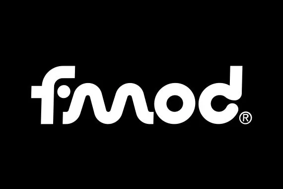

  

# FMOD Studio for O3DE AudioSystem.

This gem provides a AudioSystem implementation for O3DE using FMOD Studio, this gem also aims to be simpler in their asset pipelines
for soundbanks and individual audio streaming files, removing the need to generate settings, special dependency files generated through
scripts separatedly, as well to be fully multiplatform in both runtime and authoring.

**NOTE:**: Users wil need to download FMOD Engine SDK from [FMOD website](https://www.fmod.com/download), extract and set the FMOD SDK root folder
in CMake under the `FMOD_ROOT` variable, or set an environment variable called `FMOD_HOME` in your system.

